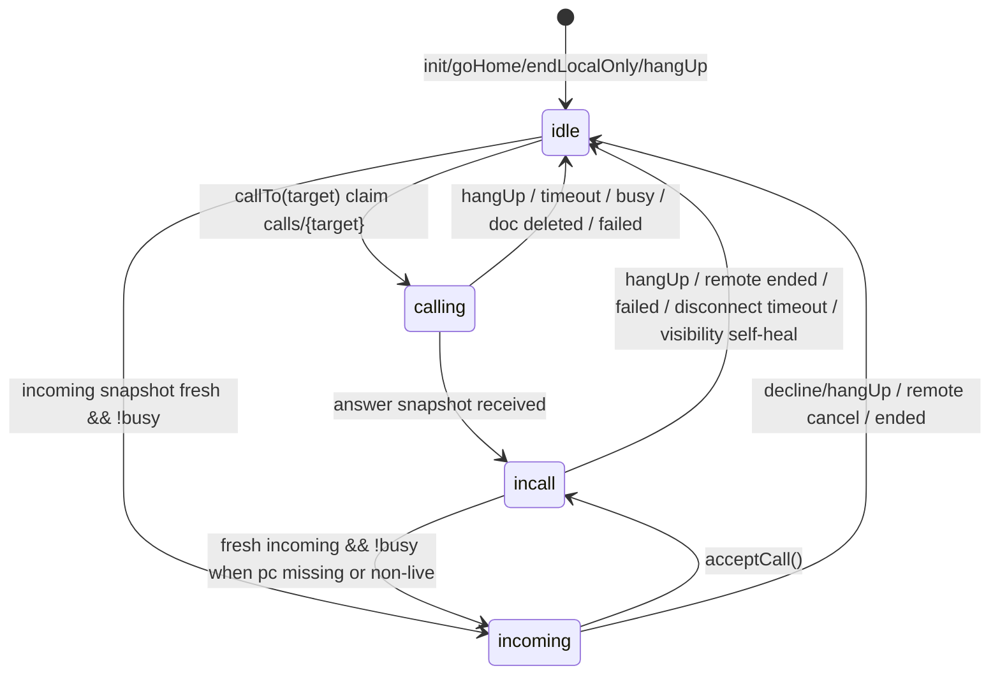

# CODEX_FINDINGS.md - Adversarial review for Kazoku Tsuwa

Date: 2026-06-15
Scope: CODEX_BRIEF.md, TESTING.md, src/main.ts, Android Java services/plugins,
AndroidManifest.xml, worker/src/index.js, firestore.rules, and build settings.

No Cloudflare API token or Firebase service-account JSON was inspected, printed,
or committed. No commit/deploy was performed.

## Executive Summary

The implementation is coherent and has many defensive patches already, but the
current design still has race conditions that can invalidate some TESTING.md
"done" judgments under tight timing. The biggest risk is not basic WebRTC setup;
it is identity/correlation drift between JS, Firestore, FCM, and native ringing.

Top findings:

1. callTo() can be re-entered and can overwrite an active call from the same
   caller because the Firestore transaction only rejects active calls from a
   different `from`.
2. ICE candidate cleanup is not call-scoped. Old delete cleanup can delete ICE
   candidates for a newer call on the same calls/{calleeId} path.
3. Native cancel_call has no callId, so a stale cancel push can stop a newer
   unrelated incoming ringtone/notification.
4. acceptCall() does not transactionally verify that the accepted document is
   still the same callId/caller before writing answer.
5. isLiveCall() is too narrow for busy detection; early incall before
   connectionState reaches connecting/connected can be treated as stale and
   overwritten by another incoming call.
6. Android 13+ POST_NOTIFICATIONS is not declared/requested while targetSdk is
   36. Full-screen/notification claims are device-dependent.
7. Android 14+ full-screen intent permission is declared but never checked with
   NotificationManager.canUseFullScreenIntent().
8. Worker/client do not clean invalid FCM tokens after UNREGISTERED or valid
   INVALID_ARGUMENT responses.

## Official Documentation Cross-Checks

- FCM data-only messages are the correct direction for background handling:
  Firebase documents that data messages are delivered to onMessageReceived in
  foreground and background, while notification payloads are handled by the
  system tray in background:
  https://firebase.google.com/docs/cloud-messaging/android/receive-messages
- onMessageReceived has a short processing window. The current native service
  only posts a notification and starts local ringtone, which is mostly aligned.
  Do not add network calls there.
- FCM high priority is appropriate for incoming calls, but Firebase warns that
  high priority should lead to visible user interaction and may be affected by
  recent behavior:
  https://firebase.google.com/docs/cloud-messaging/android-message-priority
- Android 13+ requires runtime POST_NOTIFICATIONS for non-exempt notifications;
  newly installed apps have notifications off by default until permission is
  granted:
  https://developer.android.com/develop/ui/compose/notifications/notification-permission
- Android 14+ full-screen intents are restricted to calling/alarm use cases; apps
  should check canUseFullScreenIntent() and guide users to the setting if needed:
  https://developer.android.com/about/versions/14/behavior-changes-14
- Firebase recommends deleting invalid/stale FCM tokens when HTTP v1 returns
  UNREGISTERED or valid INVALID_ARGUMENT:
  https://firebase.google.com/docs/cloud-messaging/manage-tokens

## State Machine Reconstruction

Current JS state variable: idle | calling | incoming | incall.



Important derived behavior:

- goHome() always sets appState = idle and resets peerId/latestOffer/currentCallId.
- cleanupPeer() does not set appState; callers must set it before/after.
- startIncomingListener() uses:
  busy = appState === "calling" || (appState === "incall" && isLiveCall()).
- isLiveCall() only returns true for connected or connecting. Early new/checking
  states are treated as not live.

## Findings

### F1. Same-caller active call overwrite / re-entrant callTo()

Severity: High

Evidence: src/main.ts transaction only rejects active docs when d.from !== myId.
If the same caller double-runs callTo(targetId), the new transaction can overwrite
callId, offer, and startedAt of the active call.

Concrete race:

1. User taps target twice quickly, or UI/event double fires.
2. First callTo creates callId A and later writes offer A.
3. Second callTo sees active doc where from === myId, so it overwrites with
   callId B.
4. First async path may still clear candidates or write offer after second path.
5. Caller/callee disagree about callId, candidates, and offer.

Suggested patch:

```diff
 async function callTo(targetId: string) {
   clearError();
   if (!myId) return;
+  if (appState !== "idle") {
+    showError("Another call is already in progress.");
+    return;
+  }
@@
-      if (active && d && d.from !== myId) return false;
+      if (active) return false;
```

Risk: Low. Test A7 after normal cleanup.

### F2. Candidate subcollections are not call-scoped

Severity: Critical

Evidence: deleteCallDoc() deletes the parent doc, then calls clearCandidates(ref).
Candidate subcollections live at stable paths:

- calls/{calleeId}/callerCandidates
- calls/{calleeId}/calleeCandidates

Concrete race:

1. Call A on calls/mama ends and deletes parent doc.
2. Before old clearCandidates finishes, Call B reuses calls/mama.
3. Call B starts collecting candidates.
4. Old cleanup deletes Call B candidates.
5. WebRTC fails intermittently, especially on TURN/mobile paths.

Preferred structural patch:

```diff
- calls/{calleeId}/callerCandidates/{autoId}
- calls/{calleeId}/calleeCandidates/{autoId}
+ calls/{calleeId}/sessions/{callId}/callerCandidates/{autoId}
+ calls/{calleeId}/sessions/{callId}/calleeCandidates/{autoId}
```

Lower-impact interim patch:

```diff
 addDoc(localCol, {
+  callId: currentCallId,
   candidate: c.candidate ?? "",
```

Then clear only candidate docs whose callId matches expectedCallId.

Risk: Medium. Candidate path migration affects both peers and needs two-device
Wi-Fi/mobile regression tests.

### F3. cancel_call has no callId

Severity: Critical

Evidence: JS sends cancel_call without call identity. Worker forwards only type
and fromName. KazokuMessagingService stops the global ringtone/notification for
any cancel_call.

Concrete race:

1. Papa calls Mama (call A), then cancels. cancel_call is delayed by FCM.
2. Yuki calls Mama (call B), native starts ringtone for B.
3. Delayed cancel_call from A arrives.
4. Native stops ringtone and notification for B.

Suggested patch:

```diff
// src/main.ts
- void sendIncomingPush(cancelTarget, "cancel_call");
+ void sendIncomingPush(cancelTarget, "cancel_call", id);

// worker/src/index.js
- data: { type: type, fromName: String(fromName) },
+ data: { type, fromName: String(fromName), callId: String(body.callId || "") },
```

Then in KazokuMessagingService.java, keep activeCallId; set it on incoming_call
and ignore cancel_call when callId is empty or different.

Risk: Medium. Requires JS/Worker/native coordinated change and delayed-cancel
real-device testing.

### F4. acceptCall() does not verify the current Firestore doc identity

Severity: High

Evidence: acceptCall() uses in-memory latestOffer and updateDoc(callRef,
{ answer, status: "accepted" }). It catches a missing doc but not "doc exists
but is now a different call".

Concrete race:

1. Incoming A shown.
2. Caller A cancels and deletes doc.
3. Caller B creates new calls/{myId}.
4. acceptCall() writes answer derived from A into B.
5. Both sides fail confusingly.

Suggested patch:

```diff
 const expectedCallId = currentCallId;
 const expectedPeerId = peerId;
 callRef = doc(db, "calls", myId);
+const freshSnap = await getDoc(callRef);
+const fresh = freshSnap.data();
+if (!freshSnap.exists() || fresh?.callId !== expectedCallId ||
+    fresh?.from !== expectedPeerId || fresh?.status !== "ringing") {
+  endLocalOnly("Call ended.");
+  return;
+}
```

Stronger: use a transaction to verify call identity before final answer write.

Risk: Low to medium. Test E1 and B4.

### F5. Busy detection can drop an early accepted call

Severity: High

Evidence: busy is true for incall only if isLiveCall(). acceptCall() sets
appState = incall before RTCPeerConnection necessarily reaches connecting.

Concrete race:

1. Mama taps Answer for Papa.
2. appState becomes incall, but pc.connectionState may still be new.
3. Yuki calls Mama.
4. Incoming listener treats Mama as not busy and cleanupPeer() destroys Papa's
   connection attempt.

Suggested patch:

```diff
- const busy = appState === "calling" || (appState === "incall" && isLiveCall());
+ const busy = appState === "calling" || appState === "incoming" || appState === "incall";
```

Move stale self-healing to explicit visibility/timeout checks instead of using
new incoming calls to override any non-live incall.

Risk: Medium. Must retest stuck-state recovery J1/J2.

### F6. POST_NOTIFICATIONS is missing while targetSdk is 36

Severity: High for Android 13+

Evidence: android/variables.gradle targetSdkVersion is 36. Manifest declares
USE_FULL_SCREEN_INTENT but not android.permission.POST_NOTIFICATIONS.

Impact:

- On fresh Android 13+ installs, notifications are off by default until granted.
- Native NotificationManager.notify() may not show the incoming call UI.
- TESTING.md B1/C1/H3 cannot be globally "done".

Suggested patch:

```diff
 <uses-permission android:name="android.permission.MODIFY_AUDIO_SETTINGS" />
+<uses-permission android:name="android.permission.POST_NOTIFICATIONS" />
 <uses-permission android:name="android.permission.USE_FULL_SCREEN_INTENT" />
```

Also request it in MainActivity for API 33+ or via a setup plugin method.

Risk: Low. Test fresh install on Android 13/14/15.

### F7. Android 14+ full-screen intent permission is not checked

Severity: Medium to High

Evidence: Manifest declares USE_FULL_SCREEN_INTENT, but there is no
NotificationManager.canUseFullScreenIntent() check and no
ACTION_MANAGE_APP_USE_FULL_SCREEN_INTENT settings path.

Impact:

- Device may show only a heads-up/banner instead of full-screen.
- H3 should remain unverified until the app checks permission state.

Suggested patch: add native methods checkFullScreenIntent() and
requestFullScreenIntentSettings() for API 34+, then show setup guidance when
false.

Risk: Low. Real Android 14+ test required.

### F8. FCM invalid token handling is log-only

Severity: Medium

Evidence: Worker returns FCM JSON; client logs non-OK response only. No deletion
or refresh is triggered when FCM returns invalid token errors.

Impact:

- Reinstall/device change can leave stale tokens.
- Calls appear to ring from caller perspective, but callee never receives native
  notification.

Suggested patch:

```diff
// worker response
+return json({ ok: fcmRes.ok, invalidToken: isInvalidToken(fcmJson), fcm: fcmJson }, ...);

// client
+if (result.invalidToken) show explicit setup/token-refresh error for target
```

Risk: Low. Delete only on definite UNREGISTERED or valid INVALID_ARGUMENT.

### F9. Firestore rules allow anonymous impersonation

Severity: Medium in a public repo / Low in closed family-only use

Evidence: firestore.rules allows any authenticated anonymous user to read/write
all calls/** and tokens/{memberId}.

Impact:

- Anyone with public Firebase config can overwrite tokens/papa, spoof calls, or
  delete live docs.

Suggested direction:

- Still free: add per-member pairing PIN or local invite secret hash.
- At minimum, restrict valid member IDs and allowed fields in rules.

Risk: Medium. Real identity binding needs a small onboarding design.

### F10. beforeunload cleanup remains best-effort

Severity: Medium

Evidence: beforeunload calls async deleteCallDoc() without awaiting. Android
process death, crash, force stop, or network loss can skip it.

Impact:

- G1/G2/G3 remain stale-recovered, not truly solved.
- Ringing stale at 90s is reasonable but still blocks during that window.

Suggested direction:

- Add heartbeat/lease fields such as callerSeenAt/calleeSeenAt.
- Treat absent heartbeat as ended sooner than 2h for accepted calls.

Risk: Medium. Timer writes are small for family use but need quota awareness.

## Single-document calls/{calleeId} Race Scenarios

1. Mutual simultaneous call: A writes calls/B, B writes calls/A; both enter
   calling; both incoming listeners see busy and mark the other's call ended.
2. Same-caller overwrite: A->B double call overwrites calls/B because active same
   from is allowed.
3. Old cleanup deletes new candidates because subcollection paths are reused.
4. Accept-after-replace writes an old offer's answer into a new doc.
5. Stale cancel stops new ringing because FCM cancel is not call-scoped.
6. Busy write vs caller delete can produce generic ended instead of busy.
7. Any anonymous app instance can overwrite tokens/{memberId}.

Preferred design if changing structure:

```text
calls/{callId} = { from, to, status, createdAt, updatedAt }
inboxes/{memberId}/active/{callId} = small pointer for current incoming
calls/{callId}/callerCandidates/*
calls/{callId}/calleeCandidates/*
```

This avoids subcollection reuse and makes cancellation/notification identity
explicit. Risk: High. Requires full real-device retest.

## Native/JS Start-Stop Pair Audit

| Resource | Start | Stop paths | Gap |
|---|---|---|---|
| Caller ringback | startRingback() in callTo() | cleanupPeer(), enterCallUI(), acceptCall defensive stop | Mostly paired |
| Native ringtone | KazokuMessagingService.startRinging() | JS stopRingtone(), native cancel_call, 45s autoStop | Not call-scoped |
| Notification ID 1001 | showIncomingCall() | AudioRoute.stopRingtone(), native cancel, MainActivity.onResume() | Permission gaps |
| Audio route | applyAudioRoute() | cleanupPeer() -> resetAudioRoute() | Process kill can skip reset |
| Firestore doc | callTo() transaction | hangUp()/timeout/beforeunload best effort | Process kill leaves stale docs |
| ICE candidates | createPeer() addDoc | clearCandidates() | Not call-scoped |

## FCM Delivery Assumptions

Assumptions that hold:

- Data-only FCM is the correct choice for native onMessageReceived handling in
  background.
- High priority is appropriate for a user-visible incoming call.
- onMessageReceived does short local work only.

Assumptions that remain unsafe:

- "Closed app" is not the same as force-stopped app. Test wording should
  distinguish background, swipe-away, locked, rebooted, and force-stopped.
- Android 13+ notification runtime permission is missing.
- Android 14+ full-screen intent can be disabled and is not checked.
- Token expiry/reinstall errors are not fed back into Firestore.
- If notification permission is denied, high-priority messages may not produce
  visible notifications, weakening the delivery assumption over time.

## TESTING.md Additions / Reclassifications

Recommended reclassifications:

- B1: done -> caution. Needs Android 13+ notification permission and Android 14+
  full-screen permission checks.
- C1: done -> caution. "Completely closed" must distinguish normal closed vs
  force-stopped.
- E3: caution remains, but expected "one side succeeds" is not implemented.
- F2: done -> caution. Same-callee contention is partly covered, but same-caller
  overwrite and candidate cleanup races are not.
- H3: should remain unknown until canUseFullScreenIntent() check exists.
- I4/I5: still unknown; route code improved but needs real headset tests.

Add rows:

| # | Pattern | Expected | Status |
|---|---|---|---|
| E6 | Same caller double-taps same contact rapidly | Only one call doc/offer/candidate set is created | Unknown/high risk |
| E7 | Caller cancels A, then another caller starts B before delayed cancel push arrives | B keeps ringing; stale cancel ignored by callId | Unknown/currently likely broken |
| E8 | Callee taps answer exactly as caller cancels and third party calls | Answer is not written into wrong call doc | Unknown/currently risky |
| E9 | Old call cleanup runs while new call gathers ICE | New candidates are not deleted | Unknown/currently risky |
| E10 | Busy update races with caller timeout/delete | Caller sees deterministic busy or timeout | Unknown |
| F4 | A calls B while B is early in acceptCall before pc connects | B remains busy; A receives busy | Unknown/currently risky |
| H6 | Fresh install on Android 13+ with notifications not granted | App requests permission before relying on incoming notification | Missing |
| H7 | Android 14+ full-screen intent disabled in settings | App detects and guides user to setting | Missing |
| H8 | User denies notification permission | App explains closed-app ringing cannot work | Missing |
| P1 | FCM returns UNREGISTERED for callee token | Token is cleared/refreshed or caller sees setup error | Missing |
| P2 | App restored to new phone with old token doc | New token replaces old before first call test | Partial |
| N1 | App force-stopped from system settings, then call arrives | Limitation is documented; no false done mark | Unknown |
| N2 | Phone reboots, app not opened, then call arrives | Determine whether service can receive before first launch | Unknown |

## Verification Performed

- Read CODEX_BRIEF.md and TESTING.md.
- Reviewed src/main.ts line-by-line.
- Reviewed native Java service/plugin and AndroidManifest.xml.
- Reviewed Worker FCM sender and Firestore rules.
- Ran TypeScript type check: node node_modules\\typescript\\bin\\tsc --noEmit
  succeeded.
- Did not run npm run build here because this Windows environment is known to
  hit spawn EPERM around Vite/esbuild; GitHub Actions remains authoritative.

## Patch Priority

Recommended order:

1. Add callId to push data and native ringtone/cancel correlation.
2. Block re-entrant callTo() and reject all active doc overwrites.
3. Verify call identity before acceptCall() answer write.
4. Make busy detection conservative for incoming/incall states, then retest
   stuck-state recovery.
5. Add POST_NOTIFICATIONS manifest/runtime request and Android 14 full-screen
   intent check.
6. Make candidates call-scoped. This is higher blast radius and needs real-device
   regression tests.
7. Add invalid-token handling.
8. Revisit Firestore rules/security binding after family testing stabilizes.

## Notes for Claude / Next Implementer

- Do not commit/deploy without user confirmation.
- Do not introduce paid Firebase Cloud Functions or Blaze-only paths.
- Do not print or commit Cloudflare/Firebase service-account secrets.
- Candidate path migration and ICE restart/re-negotiation are high-risk changes;
  they require real Android two-device tests on Wi-Fi/mobile networks.
