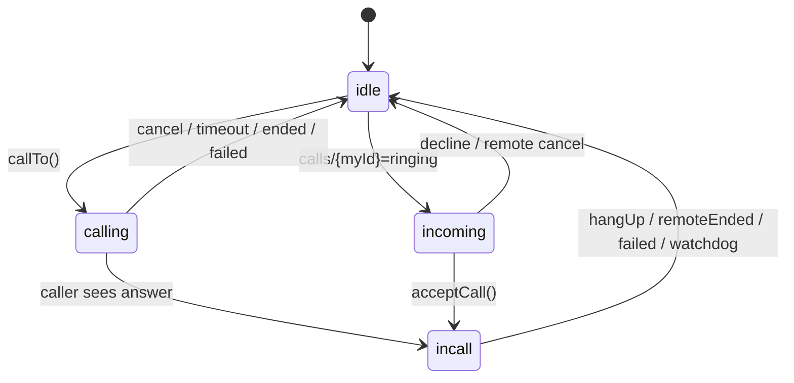

# CODEX_FINDINGS_2

作成日: 2026-06-17  
対象: `C:\Users\USR03\kazoku-build` / `main` 現状  
前提: `CODEX_BRIEF.md` → `CODEX_FINDINGS.md` → `CODEX_HANDOFF_2.md` → `TESTING.md` を読んだうえでの追加レビュー。

## 今回ユーザー実機で出た症状

- 同じ相手へ続けて電話すると、2回目以降で音声がつながらない。
- 通話中画面に耳が当たると、別画面に飛ぶ／意図しない操作が起きる。
- 変な切れ方をした後、次の発信で相手が応答しても発信側が通話画面へ切り替わらず、声もつながらない。

結論: F1-F8 の修正で良くなっているが、まだ「連続発信で安定」とは判定できない。特に `src/main.ts` の callId 取り扱い、応答確定前の UI 遷移、通話中画面の誤操作対策が P0/P1。

検証メモ: `node_modules/typescript/bin/tsc --noEmit` は成功。コミット/デプロイは未実施。

## 状態機械の再構成



重要な非対称:

- 発信側は `calls/{calleeId}.answer` を監視し、answer を受けてから `incall` に入る。
- 着信側は現状 `acceptCall()` 内で answer を Firestore に書く前に `incall` 画面へ入る。
- そのため、着信側だけ「通話中」に見えるが、発信側はまだ呼び出し中という split-brain が起きうる。

## F2 レビュー: ICE候補 callId スコープ化

### F2-1 [P0] `createPeer()` がグローバル `currentCallId` に依存している

該当: `src/main.ts:332-383`

現状:

- `createPeer()` 内で `const myCallId = currentCallId` を捕まえている。
- 呼び出し側は callId を明示していない。
- `pc.onconnectionstatechange` 内でグローバル `pc?.connectionState` を読む。

問題:

- 通話Aの終了直後に通話Bを始めた場合、A由来の遅延イベントが B の `pc` を見て `hangUp()` する経路が残る。
- `currentCallId` が null/古い値のまま `createPeer()` に入っても型・実行時チェックで止まらない。
- F2 の狙いである「候補を必ず callId 単位に固定する」が、グローバル状態に依存していて脆い。

修正案:

```diff
-function createPeer(
-  ref: DocumentReference,
-  localName: "callerCandidates" | "calleeCandidates",
-  remoteName: "callerCandidates" | "calleeCandidates",
-) {
-  pc = new RTCPeerConnection(ICE);
+function createPeer(
+  ref: DocumentReference,
+  localName: "callerCandidates" | "calleeCandidates",
+  remoteName: "callerCandidates" | "calleeCandidates",
+  callId: string,
+) {
+  const peer = new RTCPeerConnection(ICE);
+  pc = peer;
   const localCol = collection(ref, localName);
-  const myCallId = currentCallId;
+  const myCallId = callId;
 
-  pc.onicecandidate = (e) => {
+  peer.onicecandidate = (e) => {
     if (!e.candidate) return;
     const c = e.candidate.toJSON();
     addDoc(localCol, {
       callId: myCallId,
       candidate: c.candidate ?? "",
       sdpMid: c.sdpMid ?? null,
       sdpMLineIndex: c.sdpMLineIndex ?? null,
       usernameFragment: c.usernameFragment ?? null,
     }).catch((err) => console.warn("candidate 送信に失敗", err));
   };
 
-  pc.onconnectionstatechange = () => {
-    switch (pc?.connectionState) {
+  peer.onconnectionstatechange = () => {
+    if (peer !== pc) return;
+    switch (peer.connectionState) {
       case "connected":
         clearReconnectTimeout();
         clearConnectWatchdog();
         void applyAudioRoute();
         break;
       case "disconnected":
         if (!reconnectTimeout) {
           reconnectTimeout = setTimeout(() => {
-            if (pc && pc.connectionState !== "connected") {
+            if (peer === pc && peer.connectionState !== "connected") {
               void hangUp().then(() => showError("電波が不安定で通話が切れました。もう一度おかけください。"));
             }
           }, 25000);
         }
         break;
     }
   };
 
-  localStream?.getTracks().forEach((t) => pc!.addTrack(t, localStream!));
+  localStream?.getTracks().forEach((t) => peer.addTrack(t, localStream!));
 
   candUnsub = onSnapshot(collection(ref, remoteName), (snap) => {
     snap.docChanges().forEach((ch) => {
       if (ch.type !== "added") return;
       const data = ch.doc.data() as DocumentData;
       if (data.callId !== myCallId) return;
       void addOrBufferCandidate(data as RTCIceCandidateInit);
     });
   });
 }
```

呼び出し側:

```diff
-  createPeer(callRef, "callerCandidates", "calleeCandidates");
+  createPeer(callRef, "callerCandidates", "calleeCandidates", callId);
```

```diff
-  createPeer(ref, "calleeCandidates", "callerCandidates");
+  createPeer(ref, "calleeCandidates", "callerCandidates", expectedCallId);
```

### F2-2 [P0] 発信側の answer 監視が `callId` を確認していない

該当: `src/main.ts:537-559`

現状:

- `onSnapshot(callRef, ...)` が `d.status` と `d.answer` を見る。
- しかし `d.callId === callId` を確認していない。

具体シナリオ:

1. A→B 通話1が異常終了し、`calls/{B}` の監視や doc 更新が遅れる。
2. A→B 通話2が同じ doc path を使って始まる。
3. 古い監視/古い answer/古い ended を、現在の通話として扱う余地が残る。

これは「相手が出ても発信側が通話画面へ切り替わらない」「2回目以降だけ音声が無い」の説明候補になる。

修正案:

```diff
   callUnsub = onSnapshot(callRef, (snap) => {
     if (!snap.exists()) {
       remoteEnded();
       return;
     }
     const d = snap.data();
+    if (d.callId !== callId) {
+      return;
+    }
     if (d.status === "ended") {
       if (d.rejectReason === "busy") {
         endLocalOnly(`${nameOf(targetId)}は今、ほかの通話中です。`);
       } else {
         remoteEnded();
       }
       return;
     }
```

### F2-3 [P1] `incoming` 側は callId 必須にした方が良い

該当: `src/main.ts:651-660`

現状は `d.callId` が無くても `fresh` 判定に入る。旧データ移行期のためだと思われるが、F2 以降は callId なしの通話を受けるほど候補混線リスクが戻る。

修正案:

```diff
     const d = snap.data();
+    const incomingCallId = typeof d.callId === "string" ? d.callId : "";
     const fresh =
+      incomingCallId.length > 0 &&
       d.status === "ringing" &&
       d.offer &&
       d.from &&
       d.from !== myId &&
       !isStale(d);
```

```diff
-    if (fresh && d.callId !== currentCallId && !busy) {
+    if (fresh && incomingCallId !== currentCallId && !busy) {
       peerId = d.from;
-      currentCallId = (d.callId as string) ?? null;
+      currentCallId = incomingCallId;
```

### F2-4 [P2] 候補掃除は効くが、累積と大量削除に弱い

該当: `src/main.ts:321-330`

`clearOldCandidates()` は「新規発信時に keepCallId 以外を消す」ため、通常の4人家族運用なら大きな問題にはなりにくい。ただし:

- hangup 時には候補を消さないため、次回発信まで残る。
- 候補が大量化すると `Promise.all(deleteDoc(...))` が一度に走る。
- 家族用途では低リスクだが、長期運用ではバッチ/上限つき削除が望ましい。

修正案は P0 修正後でよい。

## 連続発信で2回目以降に音声がつながらない件

### R1 [P0] `acceptCall()` が answer 確定前に `incall` 画面へ入る

該当: `src/main.ts:602-638`

現状:

```ts
callRef = ref;
appState = "incall";
enterCallUI(expectedPeer);

createPeer(...);
setRemoteDescription(...);
createAnswer();
setLocalDescription(answer);
runTransaction(... answer/status accepted ...);
```

問題:

- 着信側だけ先に「通話中」になる。
- Firestore への answer 書き込みが失敗した場合、発信側は呼び出し中のまま。
- 40秒 watchdog も UI 遷移と同時に始まるため、まだ peer が完全準備できていない時点から失敗判定が始まる。

修正案: answer の transaction 成功後にだけ `incall` へ入る。二重タップ防止も入れる。

```diff
+let acceptingCall = false;
+
 async function acceptCall() {
   stopRingtone();
   stopRingback();
   if (appState !== "incoming" || !myId || !peerId) return;
+  if (acceptingCall) return;
+  acceptingCall = true;
   clearError();
 
   const expectedCallId = currentCallId;
   const expectedPeer = peerId;
+  if (!expectedCallId) {
+    acceptingCall = false;
+    endLocalOnly("通話情報が古いため応答できませんでした。もう一度かけ直してください。");
+    return;
+  }
   const ref = doc(db, "calls", myId);
 
   ...
 
   try {
     await ensureMedia();
   } catch {
+    acceptingCall = false;
     showError("マイクの使用を許可してください。");
     return;
   }
 
   callRef = ref;
-  appState = "incall";
-  enterCallUI(expectedPeer);
 
-  createPeer(ref, "calleeCandidates", "callerCandidates");
+  createPeer(ref, "calleeCandidates", "callerCandidates", expectedCallId);
   await pc!.setRemoteDescription(freshOffer);
   await flushCandidates();
   const answer = await pc!.createAnswer();
   await pc!.setLocalDescription(answer);
 
   try {
     const ok = await runTransaction(db, async (tx) => {
       ...
       tx.update(ref, {
         answer: { type: answer.type, sdp: answer.sdp },
         status: "accepted",
       });
       return true;
     });
     if (!ok) {
+      acceptingCall = false;
       endLocalOnly("通話は終了しました。");
+      return;
     }
+    appState = "incall";
+    enterCallUI(expectedPeer);
   } catch {
+    acceptingCall = false;
     endLocalOnly("通話が終了しました");
+    return;
   }
+  acceptingCall = false;
 }
```

注意: この変更は UI タイミングが変わるため、実機2台で以下を必ず確認する。

- B が応答した瞬間に A がキャンセルする。
- B が応答直後に通信断になる。
- A→B を3回連続で発信/終了する。

### R2 [P1] `callTo()` 失敗時に `currentCallId` が残る

該当: `src/main.ts:500-509`

`runTransaction` 失敗時や相手が busy のとき、`callRef` は null に戻すが `currentCallId` を戻していない。次の着信判定やログ調査を難しくする。

修正案:

```diff
   } catch (e) {
     console.error(e);
     showError("発信に失敗しました。通信環境を確認してください。");
     callRef = null;
+    currentCallId = null;
     return;
   }
   if (!claimed) {
     showError(`${nameOf(targetId)}は今、ほかの通話中か呼び出し中です。`);
     callRef = null;
+    currentCallId = null;
     return;
   }
```

### R3 [P1] watchdog は「通話UIに入った時」ではなく「peer準備後」に開始するべき

該当: `src/main.ts:385-405`

現状の 40 秒接続 watchdog は、callee では answer 書き込み前に始まる。R1 修正でかなり改善するが、さらに:

- watchdog は `peer` インスタンスを引数で受け取る。
- `peer !== pc` なら何もしない。
- モバイル回線では 40 秒はやや短い。まず 60-75 秒で実機確認する。

修正案:

```diff
-function enterCallUI(otherId: string) {
+function enterCallUI(otherId: string, peer: RTCPeerConnection = pc!) {
   ...
   connectWatchdog = setTimeout(() => {
-    if (pc && pc.connectionState !== "connected") {
+    if (peer === pc && peer.connectionState !== "connected") {
       void hangUp().then(() =>
         showError("つながりませんでした。電波状況を確認して、もう一度おかけください。"),
       );
     }
   }, CONNECT_TIMEOUT_MS);
 }
```

高リスク変更ではないが、通話確立判定に関わるため実機2台テスト前提。

## F5 レビュー: busy保守化・接続watchdog・visibility自己修復

### F5-1 [P1] busy 保守化は正しいが、同時発信は UX として未解決

`startIncomingListener()` は `appState !== "idle"` のとき新規着信を busy 終了にする。この保守化自体は妥当。ただし A→B と B→A を同時に押した場合、両者が calling になって両方 busy/ended になる可能性がある。

家族アプリとしては許容できるが、TESTING に「同時に押したら両方ホームへ戻る。片方だけ固まらない」を追加した方がよい。

### F5-2 [P1] visibility自己修復は固まり回復に有効だが、原因を隠す

該当: `src/main.ts:926-933`

`appState !== idle/incoming && !pc` をホームへ戻すのは J1/J2 回復として有効。ただし「なぜ pc が消えたか」は残らない。次のデバッグのため、最低限 `console.warn` と Firestore の callId/status をログに残したい。

## 通話中画面: 耳タッチ対策が無い

### UI-1 [P0] 通話中画面に誤操作を防ぐ仕組みが無い

該当:

- `index.html:64-80`
- `src/style.css:227-284`
- `src/main.ts:906-907`

現状の通話中画面は、上から:

- スピーカー切替
- メッセージボタン
- 終了ボタン

が常時タップ可能。受話口通話で画面が頬や耳に触れると、メッセージボタンや終了ボタンを押せる。ユーザー症状「違う画面に飛ぶ」はこれで説明できる。

最短の安全修正:

1. 通話中の `msg-call-btn` は非表示にする。メッセージ機能が未実装なので事故要因にしかならない。
2. Android ネイティブで近接センサーまたは proximity wake lock を入れる。
3. 近接センサー実装前の暫定策として、通話開始後は操作ボタンをロックし、長押しで解除する。

暫定 CSS パッチ:

```diff
 .incall-controls {
   width: 100%;
   display: grid;
   gap: 12px;
   margin-bottom: 16px;
 }
+
+/* メッセージ機能が完成するまで、通話中画面では事故防止のため隠す */
+#msg-call-btn {
+  display: none;
+}
```

ネイティブ本命案:

```diff
 <!-- android/app/src/main/AndroidManifest.xml -->
+<uses-permission android:name="android.permission.WAKE_LOCK" />
```

`AudioRoutePlugin.java` に `PROXIMITY_SCREEN_OFF_WAKE_LOCK` を追加し、`enterCallUI()` で開始、`cleanupPeer()` で停止する。機種差があるので実機2台テスト必須。

## F9: Firestore なりすまし対策を完全無料で行う案

現状:

```txt
calls/{calleeId}/** allow read, write: if request.auth != null
tokens/{memberId}   allow read, write: if request.auth != null
```

これは「匿名ログインしていれば誰でも papa/mama/yuki/akiho になれる」状態。家族内だけの非公開運用なら当面許容できるが、Public repo でAPK配布するなら設計上は弱い。

完全無料・Blazeなしの現実案:

### 推奨案: Worker 経由で memberId と Firebase anonymous uid を照合する

1. Firestore に `members/{memberId}` を作る。
   - 例: `members/papa = { uid: "<パパ端末の匿名uid>" }`
2. アプリは起動時に自分の anonymous uid を画面に表示する。
3. ユーザーが Firebase Console で4人分だけ uid を登録する。
4. `tokens/{memberId}` はクライアントから読ませない。
5. 発信時の Worker POST を `{ idToken, fromId, toId, type, callId }` に変更する。
6. Cloudflare Worker が service account で Firestore REST を読み:
   - ID token の `sub` が `members/{fromId}.uid` と一致するか確認
   - `tokens/{toId}` を読む
   - FCM 送信する

これなら:

- Firebase Cloud Functions 不要
- Blaze 不要
- Cloudflare Worker 無料枠
- 電話番号不要
- トークンを任意の匿名ユーザーに読ませない

Worker 側のスコープは FCM だけでなく Firestore 読み取り用に Datastore scope が必要:

```js
const SCOPES = [
  "https://www.googleapis.com/auth/firebase.messaging",
  "https://www.googleapis.com/auth/datastore",
].join(" ");
```

Firestore rules の方向性:

```rules
rules_version = '2';
service cloud.firestore {
  match /databases/{database}/documents {
    function signedIn() {
      return request.auth != null;
    }
    function validMember(id) {
      return ['papa', 'mama', 'yuki', 'akiho'].hasAny([id]);
    }
    function uidOf(memberId) {
      return get(/databases/$(database)/documents/members/$(memberId)).data.uid;
    }
    function isMember(memberId) {
      return signedIn() && validMember(memberId) && uidOf(memberId) == request.auth.uid;
    }

    match /members/{memberId} {
      allow read: if isMember(memberId);
      allow write: if false; // Consoleで手動登録。無料・安全優先。
    }

    match /tokens/{memberId} {
      allow read: if false; // Workerだけがservice accountで読む
      allow write: if isMember(memberId);
    }

    match /calls/{calleeId} {
      allow read: if signedIn() && validMember(calleeId);
      allow create: if signedIn()
        && validMember(calleeId)
        && request.resource.data.from is string
        && isMember(request.resource.data.from);
      allow update, delete: if signedIn()
        && validMember(calleeId)
        && (
          isMember(calleeId) ||
          (resource.data.from is string && isMember(resource.data.from))
        );

      match /{subcol}/{candidateId} {
        allow read, write: if signedIn()
          && validMember(calleeId)
          && (
            isMember(calleeId) ||
            (get(/databases/$(database)/documents/calls/$(calleeId)).data.from is string
             && isMember(get(/databases/$(database)/documents/calls/$(calleeId)).data.from))
          );
      }
    }
  }
}
```

注意:

- Firestore rules の `get()` 回数制限に注意。候補 write が多いので rules を複雑にしすぎるとコスト/制限に当たりやすい。
- まずは `tokens` の Worker化から段階導入するのがよい。
- Console 手動登録が非技術ユーザーに少し負担。アプリ上に「この端末IDをコピー」ボタンを出すとよい。

## F10: 強制終了の残骸/ハートビートを完全無料で行う案

Cloud Functions / Cloud Scheduler は使わない。クライアント同士と「次回発信時の掃除」で処理する。

### 推奨データ

`calls/{calleeId}` に追加:

```ts
{
  callId,
  from,
  to,
  status: "ringing" | "accepted" | "ended",
  startedAt,
  callerSeenAt,
  calleeSeenAt,
  endedAt,
  endReason
}
```

### 動き

- calling/incall 中は 15 秒ごとに自分側の `SeenAt` を `serverTimestamp()` で更新。
- snapshot で相手側 `SeenAt` が 60-90 秒古ければ、ローカル終了して doc を ended/delete。
- アプリ起動時と発信前に、2分以上古い `ringing/accepted` を stale とみなし再利用可能にする。

概算:

- 通話中 2台で 15秒ごとに書くと 1分あたり約8 writes。
- 家族4人の通常利用なら無料枠内に収まりやすい。
- ただし長時間通話が多い場合は 30秒間隔にする。

パッチ方向:

```diff
+let heartbeatTimer: ReturnType<typeof setInterval> | null = null;
+
+function startHeartbeat(role: "caller" | "callee", ref: DocumentReference, callId: string) {
+  stopHeartbeat();
+  const field = role === "caller" ? "callerSeenAt" : "calleeSeenAt";
+  heartbeatTimer = setInterval(() => {
+    updateDoc(ref, { [field]: serverTimestamp() }).catch(() => {});
+  }, 15000);
+}
+
+function stopHeartbeat() {
+  if (heartbeatTimer) clearInterval(heartbeatTimer);
+  heartbeatTimer = null;
+}
```

`cleanupPeer()` で `stopHeartbeat()`。  
高リスクではないが、Firestore 書き込み増加とバックグラウンド制限が絡むので実機テスト必須。

## TESTING.md に追加すべき異常系

1. A→B を発信、B が出る前に A が切る、すぐ A→B を再発信。
2. A→B 通話を確立、B が切る、すぐ A→B を再発信。これを3回繰り返す。
3. A→B と B→A を同時に押す。両方が固まらずホームへ戻ること。
4. B が応答ボタンを押した瞬間に A がキャンセルする。
5. 通話中に画面へ頬/耳が当たっても、メッセージ画面や終了に誤操作しないこと。
6. 通話中に一方のアプリを強制終了し、相手が60-90秒以内に固まりから戻ること。
7. FCM token を古くした状態で発信し、再設定案内または token 再保存が走ること。
8. 1台Wi-Fi/1台4Gで、発信方向を入れ替えて3連続通話すること。

## その他おかしいところ

### O1 [P2] 正本フォルダに隠し `.DOCX` が残っている

`C:\Users\USR03\kazoku-build` と `worker/` に `VHO34KUL.DOCX` が見える。`git status` は clean なので現状コミット対象ではないが、会社PCセキュリティ由来のファイルが再発している。

`.gitignore` に以下を追加して事故を防ぐ。

```diff
+*.doc
+*.docx
+*.DOC
+*.DOCX
```

削除はユーザー確認後でよい。

### O2 [P2] Worker は ID token を検証しているが、memberId との対応は未検証

`worker/src/index.js` は Firebase ID token の署名/期限を見ている。これは良い。ただし現状 POST body の `fromName` と `toToken` はクライアント申告なので、匿名ログインした第三者でも token を知れば通知を送れる。

F9 の Worker化で `fromId/toId` と `members/{fromId}.uid` を照合すれば解消できる。

## Claude Code への推奨順

1. P0だけ先に小さく直す。
   - `createPeer(..., callId)` 化
   - 発信側 answer 監視で `d.callId !== callId` を無視
   - `acceptCall()` の `enterCallUI()` を answer transaction 成功後へ移動
   - callId なし incoming を拒否
2. `npm run build` と GitHub Actions APK ビルド。
3. 実機2台で「同じ相手に3連続通話」を先に確認。
4. 通話中誤タッチ対策:
   - まず `msg-call-btn` 非表示
   - 次に proximity wake lock を実装
5. F9/F10 はデータモデル/ルール/Workerを触るので、P0安定後に別ブランチ相当で進める。

高リスク注意:

- ICE 再交渉や DataChannel 化は今は入れない。
- Firestore rules 厳格化は一歩間違えると全員着信不能になるため、実機2台で段階テストする。
- Worker に Firestore 読み取りを入れる場合、サービスアカウント権限と scope を増やす。秘密JSONは絶対に表示・コミットしない。
